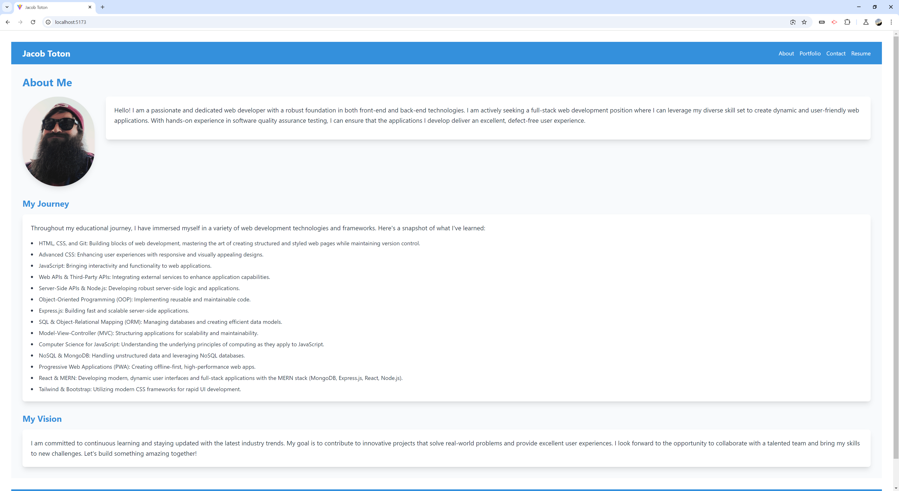

# CodeCanvas: React Portfolio

## Description

CodeCanvas is a dynamic, responsive web portfolio built using React and styled with Tailwind CSS. It showcases my skills, projects, and professional information in an interactive and visually appealing manner. This portfolio is designed to highlight my capabilities as a full-stack web developer, software qaulity assurance tester and provide potential employers or clients with an comprehensive overview of my work.

## Table of Contents

- [Screenshot](#screenshot)
- [Usage](#usage)
- [Features](#features)
- [Technologies Used](#technologies-used)
- [Deployment](#deployment)
- [Contributing](#contributing)
- [License](#license)
- [Questions](#questions)
- [Citations](#citations)

## Screenshot

## Usage

To view the portfolio, simply visit the deployed application URL. Navigate through different sections using the menu in the header. Click on project links to view deployed applications or GitHub repositories.

## Features

- Responsive design that works on desktop and mobile devices
- About Me section with a brief bio
- Portfolio section showcasing recent projects with links to deployed applications and GitHub repositories
- Contact form for easy communication
- Downloadable resume and list of proficiencies
- Links to GitHub, LinkedIn, and other professional profiles

## Technologies Used

- React.js
- Vite
- Tailwind CSS
- React Router
- Netlify (for deployment)

## Deployment

The portfolio is deployed using Netlify. You can view the live application [here](https://cute-starlight-3ccc21.netlify.app).

## Contributing

Contributions to this project are not currently accepted. This is a graded classroom assignment, and it is an assessment of the developer's skills.

## License

This project is licensed under the MIT License.

## Questions

If you have any questions about the CodeCanvas, you can reach me at Jake_Toton@live.com. You can find more of my work at [Jtoton](https://github.com/Jtoton).

## Citations

- Tailwind CSS Documentation: [https://tailwindcss.com/docs](https://tailwindcss.com/docs)
- React Documentation: [https://reactjs.org/docs/getting-started.html](https://reactjs.org/docs/getting-started.html)
- Vite Documentation: [https://vitejs.dev/guide/](https://vitejs.dev/guide/)
- React Router Documentation: [https://reactrouter.com/web/guides/quick-start](https://reactrouter.com/web/guides/quick-start)
- Netlify Documentation: Welcome to Netlify. (n.d.). Netlify Docs. https://docs.netlify.com/
- Module 20 challenge. (n.d.). https://bootcampspot.instructure.com/courses/5301/assignments/74833
- Canvas assignment page which housed the assignment description, requirements and acceptance criteria.
- This additionally provided a mockup of the project functionality.
- Additional assistance was obtained via the teaching staff.
- ChatGPT. (n.d.). https://chatgpt.com/
- ChatGPT was used to assist in the creation and editing of the about me paragraph sections.
